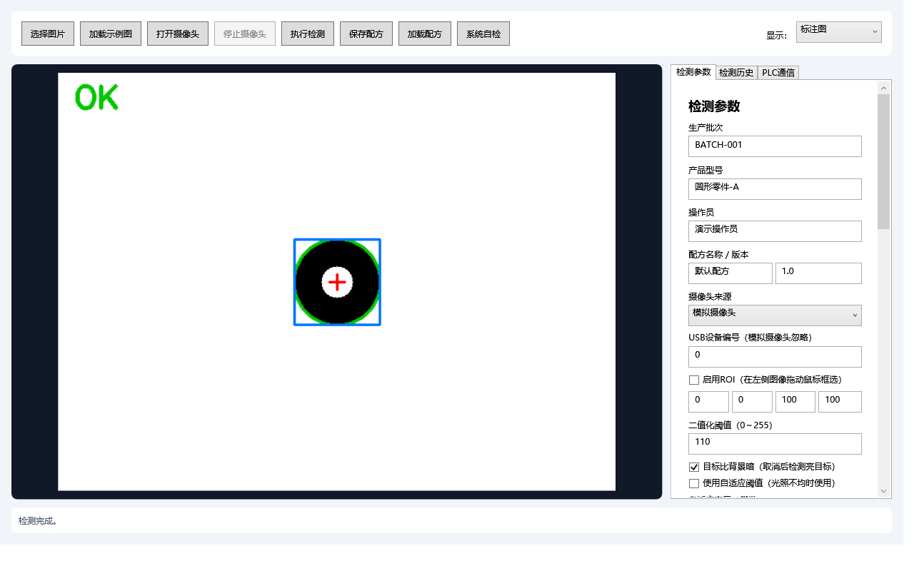

# 工业零件视觉检测上位机



这是一个面向工业视觉检测场景的完整上位机项目。项目使用 C#、WPF、MVVM 和 OpenCvSharp，实现图像采集、视觉检测、OK/NG 判定、数据追溯和 PLC 通信模拟，可用于工程实践、技术展示和求职作品集。

## 当前进度

当前版本：`1.1.0`。计划中的核心闭环已经完成，并完成第一轮可靠性优化。

- 建立 .NET 8 WPF 项目骨架
- 使用简化 MVVM 分离界面和业务逻辑
- 支持选择本地图片
- 支持通过OpenCV打开USB摄像头并后台连续采集
- 相机通过`ICamera`和`ICameraFactory`解耦，便于增加工业相机SDK适配器
- 内置移动目标模拟摄像头，无硬件也能演示实时采集
- 支持停止、取消、最新帧快照和三次有限重连
- 支持灰度化、滤波、反二值化、形态学和轮廓检测
- 支持深色/亮色目标切换与光照不均场景的自适应阈值
- 输出目标数量、最大面积、中心、宽高、圆度和处理耗时
- 根据数量、面积和圆度给出可解释的 OK/NG 结果
- 独立输出圆度、长宽比、中心偏移等可解释NG代码
- 支持配置像素当量，将像素宽高和面积换算为毫米与平方毫米
- 支持原图、灰度图、二值图和标注图切换
- 提供可调整的基础检测参数
- 鼠标框选ROI，支持JSON配方保存和加载
- 配方覆盖前自动备份旧内容，相同内容不重复备份，每个配方保留最近20版
- 支持数量、面积、圆度、宽度和高度规格判定
- SQLite保存检测历史，支持结果、批次和日期查询
- 追溯产品型号、操作员、配方名称/版本和PLC周期号，并支持按产品查询
- OK/NG统计、CSV导出和NG证据图
- 支持确认后清理超过7天且数据库未引用的孤立NG图片
- 使用每日JSONL审计检测、配方、PLC周期和NG清理等关键操作，审计失败不阻塞主流程
- 内置系统自检，逐项检查数据目录、SQLite、OpenCV运行库和默认配方
- 筛选统计与当前结果口径一致，并显示各类NG数量分布
- 内置TCP PLC模拟器，支持START/BUSY/RESULT/ACK握手
- 支持PING、心跳、超时、断线检测和最多4次自动重连
- PLC通信通过`IPlcClient`抽象，便于后续增加真实Modbus或厂商协议适配器
- 自动模式下锁定检测参数和配方信息，避免生产周期中误改配置
- 包含58项自动化测试、配方备份、审计并发、资源增长回归、旧数据库迁移、PLC跨重连周期去重、WPF实时帧界面测试和30分钟混合稳定性验证

## GitHub持续集成

仓库包含`.github/workflows/ci.yml`。推送到`main`或创建Pull Request时会在Windows环境自动：

1. 还原.NET依赖。
2. 运行Release自动化测试。
3. 发布Windows x64自包含版本。
4. 上传可下载的构建产物。

推送形如`v1.1.0`的版本标签时，`.github/workflows/release.yml`会重新测试、
发布和自检，随后创建带Windows x64压缩包的GitHub Release。

Dependabot每月检查NuGet包和GitHub Actions版本；Bug与功能建议使用仓库内置Issue表单。

首次推送前可执行本地审计：

```powershell
powershell -ExecutionPolicy Bypass -File scripts\pre-push-check.ps1
```

脚本会检查Git差异、大文件、常见密钥格式和GitHub配置，运行Release自动化测试，
生成自包含发布包，并直接执行最终EXE的`--self-test`。

USB摄像头代码已经完成并通过假相机生命周期测试，但仍需在连接实际摄像头的目标电脑上验证设备兼容性和现场图像效果。

## 开发环境

- Windows 10/11 x64
- Visual Studio 2022
- .NET 8 SDK
- “.NET 桌面开发”工作负载

## 运行方法

```powershell
dotnet restore IndustrialVisionStudent.csproj
dotnet run --project IndustrialVisionStudent.csproj
```

也可以直接使用 Visual Studio 打开 `IndustrialVisionStudent.csproj`。

## 免安装版本

进入 `release/IndustrialVisionStudent-v1.1.0-win-x64`，双击 `IndustrialVisionStudent.exe`。自包含版本不要求目标电脑预装.NET。

## 推荐演示流程

1. 点击“系统自检”，确认数据目录、数据库、OpenCV和默认配方全部通过。
2. 点击“加载示例图”，或者选择“模拟摄像头”后点击“打开摄像头”。
3. 调整阈值、面积和圆度，点击“执行检测”。
4. 在图像上拖动鼠标设置ROI，再次检测。
5. 保存并重新加载JSON配方。
6. 在“检测历史”查看记录、统计、NG图片并导出CSV。
7. 在“PLC通信”依次启动模拟器、连接、PING。
8. 勾选自动模式，点击“模拟PLC发送START”，观察完整握手和自动检测。

## 本地数据

运行数据保存在：

```text
%LOCALAPPDATA%\IndustrialVisionStudent
├─ Data\inspection.db
├─ NGImages\yyyy-MM-dd\*.png
└─ Logs\Audit\audit-yyyy-MM-dd.jsonl
```

## 验证命令

```powershell
powershell -ExecutionPolicy Bypass -File scripts\test.ps1
powershell -ExecutionPolicy Bypass -File scripts\publish.ps1
powershell -ExecutionPolicy Bypass -File scripts\run-long-stability.ps1
```

依赖已经还原且需要离线验证时，可以给测试和发布脚本添加`-NoRestore`。

## 建议测试图片

先使用白色背景、深色目标的图片，例如硬币、垫片、瓶盖或打印出的黑色圆形。当前算法使用反二值化，因此深色物体应位于较亮背景上。

## 项目边界

当前版本使用本地图片验证算法，不代表真实工业产线性能。默认尺寸单位为像素；完成实物标定前，不在简历中宣称毫米级测量精度。

软件已经支持填写像素当量并显示毫米结果，但默认值为`0`（未标定）。只有使用标定板或已知尺寸标准件获得可靠的`mm/px`数值后，毫米结果才具有实际测量意义。

详细范围和进度见 [项目计划书](docs/项目计划书.md)、[开发任务清单](docs/开发任务清单.md)与[测试报告](docs/测试报告.md)。

真实PLC接入约束和适配方法见[PLC适配接口说明](docs/PLC适配接口说明.md)。
工业相机SDK接入约束和验收方法见[相机适配接口说明](docs/相机适配接口说明.md)。

准备上传仓库时，请按照[GitHub发布指南](docs/GitHub发布指南.md)配置真实提交身份、远程地址并完成首次推送。
